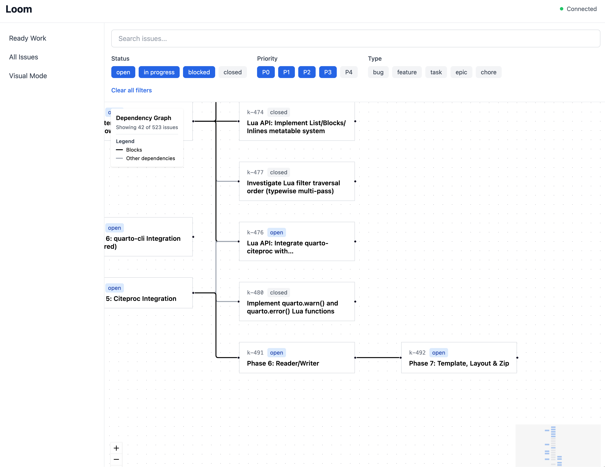

# Loom

A modern web interface for [beads](https://github.com/steveyegge/beads) - where the threads of your work come together.



## What is Loom?

Loom provides a visual, browser-based UI for managing [beads](https://github.com/steveyegge/beads) issue databases. While beads excels at CLI-based issue tracking for LLM-assisted development, Loom adds powerful visualization and navigation tools for human developers managing the work.

## Features

- **Multiple Views**: List view, Kanban board, dependency graph, and ready work queue
- **Dependency Visualization**: Interactive graphs showing how issues connect and block each other
- **Real-time Sync**: Automatically updates when `.beads/issues.jsonl` changes (from CLI or agents)
- **Powerful Filtering**: Filter by status, priority, type, and labels
- **Full Issue Management**: Create, update, and close issues directly from the UI

## Installation

```bash
# Clone the repository
git clone https://github.com/cscheid/beads-ui.git
cd beads-ui

# Install dependencies (requires pnpm)
pnpm install

# Build all packages
pnpm build
```

## Usage

### Quick Start with the Wrapper Script

The easiest way to use Loom is with the `loom` wrapper script:

```bash
# From your project directory
/path/to/beads-ui/loom .

# Or specify a project path
/path/to/beads-ui/loom /path/to/your-project
```

The web UI will open at http://localhost:5173 and the server runs on http://localhost:3000.

### Alternative Methods

**Using environment variable:**

```bash
WORKSPACE_PATH=/path/to/your-project pnpm dev
```

**Using CLI arguments:**

```bash
# From the beads-ui directory
pnpm --filter @loom/server dev --workspace /path/to/your-project

# Start both server and web UI
WORKSPACE_PATH=/path/to/your-project pnpm dev
```

**For development on the beads-ui project itself:**

```bash
# From the beads-ui directory
WORKSPACE_PATH=. pnpm dev
```

The server automatically watches your `.beads/` directory for changes and broadcasts updates via WebSocket.

## Architecture

Loom is a monorepo with three packages:

- **web**: React + TypeScript frontend (Vite, Tailwind CSS, shadcn/ui)
- **server**: Node.js/Fastify backend with WebSocket and file watching
- **shared**: Shared TypeScript types and utilities

## Requirements

- Node.js 18+
- pnpm
- [beads](https://github.com/steveyegge/beads) CLI installed and initialized in your project

## License

MIT - see [LICENSE](LICENSE) for details
